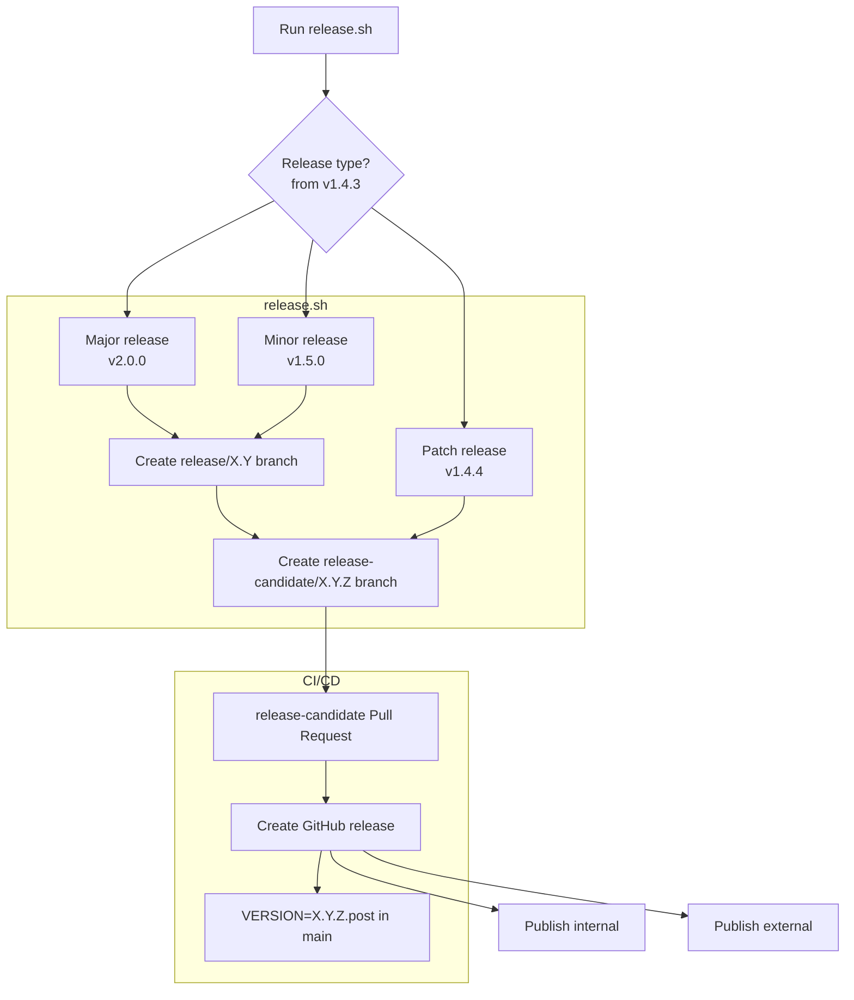
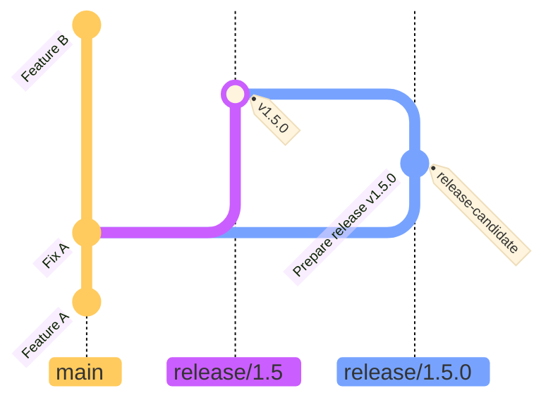
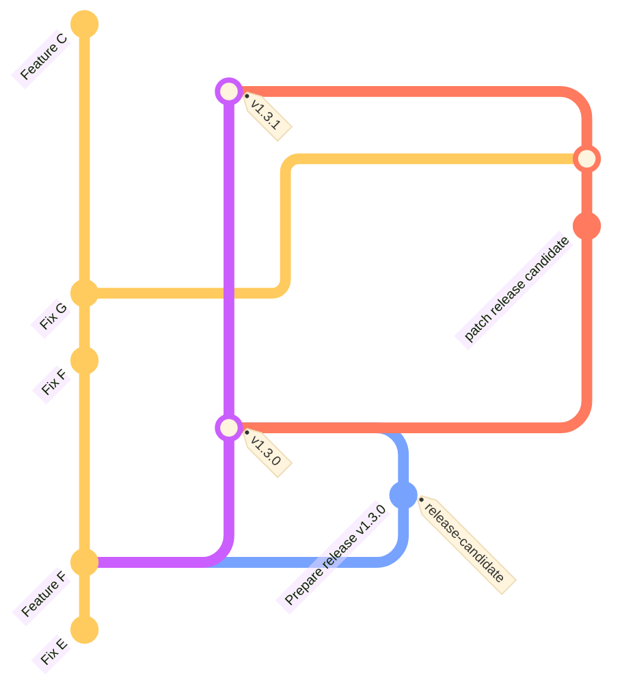

<!--
SPDX-FileCopyrightText: Copyright 2026 Arm Limited and/or its affiliates <open-source-office@arm.com>

SPDX-License-Identifier: Apache-2.0
-->

# Set up a local virtual environment for development

You can install the tool locally using the editable mode of pip (`pip install -e`).
This lets your changes to the source tree take effect immediately without reinstalling the package.

1. Clone this repository.

1. Use pip to install the required Python development dependencies:

   ```
   python -m ensurepip; pip install -r requirements_dev.txt
   ```

1. Create a virtual environment (venv), build the C binaries, and install the tool into that environment:

   ```
   ./build.sh devel
   ```

1. Activate the virtual environment and run ASCT.

    a. Use the build script to start a root prompt in the virtual environment:

      ```
      ./build.sh activate
      asct
      ```

    b. Alternatively, activate the development virtual environment manually and run the tool as `sudo`:

      ```
      source devel/venv/bin/activate
      sudo -E env PATH=$PATH asct
      ```

Now any changes to the Python code will reflect automatically when running `asct` inside the virtual environment.

> [!NOTE]
> If you change the C source code, recompile it before running ASCT again. To rebuild only the C binaries, run:
>
> ```
> ./build.sh bin
> ```

# Clean the build environment by removing all generated artifacts and compiled C binaries

```
./build.sh clean
```

The script deletes all build output directories and resets the C code to a clean state.

# Run linters, static checks, and formatters locally

The CI/CD pipeline uses [ruff](https://docs.astral.sh/ruff/) to lint code, run static checks, and verify formatting.

To run the same checks locally before submitting a PR, [install ruff](https://docs.astral.sh/ruff/installation/) and run:

```
ruff check
ruff format
```

# Releases

## Build the release PIP source package

You can build the tool into a standard Python package and install it on a target machine. After building, you will find the resulting package in `dist/asct-<version>.tar.gz`

1. Clone this repository.

1. Run the following command to build `dist/asct-<version>.tar.gz`:

   ```
   ./build.sh release
   ```

1. Optional: For a fast sanity check, add `--quick-test` to the build command:

   ```
   ./build.sh release --quick-test
   ```

   The script creates a virtual environment, installs the tool, runs a simple command, and then deletes the virtual environment.

## Create a new release

To publish a release of ASCT:

1. Start with a clean working copy, with `main` checked out. `scripts/release.sh` uses `git fetch` and `git switch -c` to switch and create branches.

1. Call `scripts/release.sh [bumptype]`. You can choose `major` or `minor` (default) version increments, or choose `patch X.Y` to increment the patch release on the release/X.Y branch. If needed, this script will create a `release/X.Y` branch. It will create a `release-candidate/X.Y.Z` branch and corresponding PR with the `release-candidate` label.

1. [Optional] `cherry-pick` or `merge` main into the `release-candidate/X.Y.Z` branch, or add hotfix commits.

1. Perform a BlackDuck scan and update the Third-Party License file:

    a. Run the [BlackDuck](https://github.com/Arm-Debug/asct/actions/workflows/blackduck.yaml) workflow - select the branch of the release candidate.
  
    b. (one-time setup) Get an API token from https://arm.app.blackduck.com/api/current-user/tokens.
  
    c. Run the helper script to get the updated license report:
  
     ```
     export ITS_BLACKDUCK_KEY=<your_blackduck_api_token>
     scripts/update_license_notices.sh --version-name X.Y.Z
     ```

    By default, the script creates or reuses the version, creates or reuses the Notices report, waits for completion, downloads the report zip, and writes the contained notices `.txt` into `THIRD-PARTY-LICENSES`.
  
    If needed, set a custom output path with `--output-file <path>`. Double-check the diff on that file to ensure it lists expected licenses.

1. Review CI test results and get a review from team members. When you merge the pull request into its release branch, `create-release.yml` will create a [GitHub Release](https://github.com/Arm-Debug/asct/releases/tag/v0.2.0) with build artifacts, documentation, and release notes. The GitHub release will include links to run workflows to publish to Artifactory.

1. For major/minor releases, a new PR on main will be automatically created to set [VERSION](VERSION) to `X.Y.Z.post`. Merge it.

1. Run the 'Publish to Artifactory' workflow (there's a link at the bottom of the GitHub Release). Specify the right tag (`v.X.Y.Z`) and choose external/internal to send artifacts to our Artifactory repo. 

### The release branching strategy

This project uses semantic versioning (`major.minor.patch`).
The version appears both in the [VERSION](VERSION) file and in the corresponding Git tag, such as [v0.1.0](https://github.com/Arm-Debug/asct/releases/tag/v0.1.0).

Each 'release' has:

- a unique version `major.minor.patch` in `VERSION`
- a git tag `v[major].[minor].[patch]` e.g. `v1.2.3`
- a release branch `release/[major].[minor]` e.g. `release/1.2`. A release branch can have multiple patches which are all releases, e.g. `v1.2.0` and `v1.2.1` would both be on the `release/1.2` branch.
- a [GitHub Release](https://github.com/Arm-Debug/asct/releases/tag/v0.2.0) with artifacts
- optional artifactory uploads

As shown in below, the starting point for a new or maintained release is [release.sh](scripts/release.sh).
By default, it will create a _minor_ release, but it accepts flags to create a _major_ release or a _patch_ release (which must be based on an existing release branch).



### Create a major/minor release

```
# assuming the most recent release branches include:
# - release/1.4
# - release/1.3

./scripts/release.sh --major              # creates release/2.0 and release-candidate/2.0.0
./scripts/release.sh --minor              # creates release/1.5 and release-candidate/1.5.0
```

Assuming `release/1.4` is the latest release, `release.sh --minor` script fetches branches to determine the new version number to generate. It will create a `release/1.5` branch based off of main. It then opens a pull request for the release candidate, with a changelog of commits since the last release and an updated [VERSION](VERSION) file. The newly created pull request requires reviews and passing CI tests. We can make CI tests more rigorous for these pull requests at a later point, maybe by using the label `release-candidate`. Note that the pull request for the `release/1.5.0` branch is merged into `release/1.5`, but not back into main.



After you merge the release pull request, [create-release.yml](.github/workflows/create-release.yml) will
trigger. The workflow:

1. tags the merged commit something like `v1.5.0`
1. creates a GitHub release from the new tag
1. builds and uploads artifacts to the release (sdist python package, documentation)

The release engineer may then run the [Publish To Artifactory](https://github.com/Arm-Debug/asct/actions/workflows/publish-to-artifactory.yml) workflow to distribute build artifacts and documentation to an inernal Artifactory repo. Be sure to run the action on the proper _tag_ name (vX.Y.Z).

Finally, the release engineer may re-run the [Publish To Artifactory](https://github.com/Arm-Debug/asct/actions/workflows/publish-to-artifactory.yml) workflow with the 'publish external' input set true to distribute build artifacts and documentation to an external Artifactory repo. Be sure to run the action on the proper tag name (vX.Y.Z).

### Create a patch release

```
# assuming the most recent release branches include:
# - release/1.3
# and the most recent tags include:
# - v1.3.0

./scripts/release.sh --patch release/1.3  # release/1.3 already exists. creates release-candidate/1.3.1

# update the release/1.3 branch with the latest updates from main
# alternatively, cherry-pick or commit hotfixes
git checkout release-candidate/1.3.1
git merge main
git push
```

For patch releases, `release.sh` will branch off of the existing `release/X.Y` a new `release/X.Y.Z`.


After the `release-candidate/1.3.1` pull request is merged into `release/1.3`, the [create-release.yml](.github/workflows/create-release.yml) will run just like it does for major/minor releases.

In all cases, every release gets a unique tag, and every release tag gets a GitHub Release page.