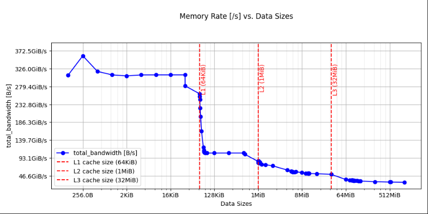

<!--
SPDX-FileCopyrightText: Copyright 2026 Arm Limited and/or its affiliates <open-source-office@arm.com>

SPDX-License-Identifier: Apache-2.0
-->

# Memory characterization

ASCT includes benchmarks that measure memory latency and bandwidth.

For memory benchmarks, set `cycle_base` with `--update-config` to choose output units:

- `cycle_base=true` uses cycle-based latency and bandwidth units such as `cycle` and `B/cycle`.
- `cycle_base=false` uses time-based and throughput units such as `ns` and `GB/s`.

The following example runs selected benchmarks and sets `cycle_base` to `true` for each selected benchmark:

```bash
asct run latency-sweep bandwidth-sweep loaded-latency --output-dir runA \
  --update-config latency-sweep.cycle_base=true \
  --update-config bandwidth-sweep.cycle_base=true \
  --update-config loaded-latency.cycle_base=true
```

## Latency

The following latency benchmarks are available:

- Latency sweep
- Idle latency
- Loaded latency
- Core-to-core latency

### Latency sweep

- Use this benchmark to measure memory latency across data sizes from 128 bytes to 1 GiB. The results include the average access latency for each size.

- The results show how memory access latency changes across cache levels and dynamic random-access memory (DRAM). These changes indicate transitions in the cache hierarchy.

- Randomized linked lists prevent hardware prefetching from influencing the latency measurements.

- The benchmark uses 1 GiB huge pages. Using huge pages reduces the effect of page table walks and translation lookaside buffer lookups on latency measurements. Note that on some systems, huge pages are referred to as large pages.

- The benchmark calculates:

  - Lower and upper bounds for each cache level

  - Average latencies

  - The optimal data size for L1, L2, last-level cache (LLC), and DRAM. Other memory benchmarks like Idle Latency and Loaded Latency reuse these sizes to improve precision.

```
    Latencies at different levels of cache
    --------------------------------------
    Level Lower bound Upper bound Optimum data size Latency [ns]
    L1           128         64K         32.0625K          1.5
    L2           64K        512K             288K          5.2
    LLC           1M          8M             4.5M         48.1
    DRAM         32M          1G             528M        107.6
```

- The benchmark also generates a line graph and saves it as `latency-sweep.png` in the output directory.

  The plot includes the following information:

  - cache-size markers and labels such as L1, L2, and LLC

  - denser minor grid lines between major log-scale ticks


### Idle latency

- Use this benchmark in a non-uniform memory access (NUMA) system to measure memory access latency. The benchmark measures latency from the last core on each node to the local and remote memory of that node.

- To characterize the system accurately, ensure it is idle. Close all applications and background processes except the test itself. ASCT imposes only the minimal load needed for measurement, but it cannot control other background activity that might affect test results.

- The benchmark produces a matrix of size n by n, with n equal to the number of NUMA nodes.

```
  Latencies of random memory access at idle (in nanoseconds)
  ----------------------------------------------------------
          Node 0 Node 1
  Node 0  113.3  266.9
  Node 1  266.5  115.7
```

**Note**: ASCT derives the data size used to target DRAM from the `latency-sweep` benchmark. If you do not select this benchmark manually, ASCT automatically includes `latency-sweep` as a dependency.

### Loaded latency

- Use this benchmark to measure the memory latency of the last core on the first NUMA node to its local memory, while other cores generate increasing memory traffic.

- To vary memory pressure, ASCT interleaves memory reads with different numbers of no-operation instructions (NOPs).

```
    Loaded latency with background memory activity
    ------------------------------------------------
     Injected NOPs  Loaded latency [ns]  Bandwidth [GB/s]
              3000                115.5              10.7
               900                115.8              35.2
               500                117.6              61.4
               180                122.2             175.3
               100                129.2             306.5
                80                134.1             385.0
                70                138.3             441.8
                50                158.8             603.9
                40                193.9             753.7
                30                250.7             912.7
                20                266.5             918.3
                10                281.0             918.3
                 0                305.4             920.7
```

**Note**: ASCT derives the data size used to target DRAM from the `latency-sweep` benchmark. If you do not select this benchmark manually, ASCT automatically includes `latency-sweep` as a dependency.

### Core-to-core latency

- Use this benchmark to measure the latency of cache line transfers between pairs of CPU cores across the system.

- The benchmark uses a ping-pong microbenchmark that alternates shared memory access and modification between 2 threads pinned to different cores.

- The shared memory region is a randomized linked list. The benchmark pointer-chases this list so that each memory access depends on the result of the previous one. This approach prevents hardware prefetchers from interfering with results.

- The benchmark binds the memory region to a specific NUMA node. This approach enables you to measure core-to-core latency both locally on the same node and remotely across nodes. This distinction helps you understand the impact of NUMA topology on inter-core communication.

- The benchmark calculates:

  - Node-to-node median latency matrices that summarize inter-node and intra-node communication costs.

  - Highest-latency core pairs that highlight outliers and potential bottlenecks.

  - Asymmetry in latency between different directions, for example A to B versus B to A.

- The benchmark presents results as:

  - Tables that show node-to-node and core-to-core latencies.

  - Heatmaps that show latency patterns across all core pairs.

  - CSV and JSON files that support further analysis.

```
    Core-to-Core Latency Summary (ns): Data Address @ Local Numa Node
    =================================================================
    Node-to-Node Median Latency Matrix (ns):
    ----------------------------------------
            Node0   Node1
    Node0   31.91  152.86
    Node1  153.10   32.00

    Latency Statistics (ns):
    ------------------------
    Min       : 23.81
    Max       : 161.65
    Mean      : 92.87
    Median    : 140.66

    Top Latency Core Pairs with Median Latency
    ------------------------------------------
    CPUA   CPUB    Latency (ns)
    ---------------------------
    186       91         161.65
    187       83         161.37
     95      186         161.29
     91      190         161.12
    178       90         161.02
    186       83         160.50
     82      157         160.44
     83      176         160.42
     90      187         160.42
     90      159         160.41

    Node-to-Node Latency Statistics (ns):
    -------------------------------------

    Node0 → Node0:
    Min:    24.68 ns
    Max:    42.24 ns
    Mean:   32.16 ns
    Median: 31.91 ns

    Node0 → Node1:
    Min:    112.43 ns
    Max:    161.29 ns
    Mean:   152.67 ns
    Median: 152.86 ns

    Node1 → Node0:
    Min:    141.72 ns
    Max:    161.65 ns
    Mean:   153.14 ns
    Median: 153.10 ns

    Node1 → Node1:
    Min:    23.81 ns
    Max:    41.44 ns
    Mean:   32.26 ns
    Median: 32.00 ns
```


#### Ping-pong microbenchmark

- Use this benchmark to measure latency between 2 CPU cores by forcing cache line transfers between them.

- The benchmark pins 2 threads on the target cores.

- Each thread alternates between accessing and modifying the shared data structure. During its turn, a thread performs a complete pointer chase on the structure.

- The benchmark uses cache invalidation and data dependency chains to estimate latency.

- When one thread writes to the shared data structure, the corresponding cache line in the other core is evicted.


#### NUMA and memory binding

- The benchmark distinguishes between local and remote cache line transfers by binding the memory region to a specific NUMA node. Local transfers, where the cores and memory are on the same node, typically show lower latency. Remote transfers, where the cores and memory are on different nodes, show the cost of traversing the NUMA interconnect.

## Bandwidth

The following bandwidth benchmarks are available:

- Bandwidth sweep
- Cross-NUMA bandwidth
- Peak bandwidth

### Bandwidth sweep

- Use this benchmark to measure the average memory bandwidth achieved by a single core at each level of the memory hierarchy (L1, L2, LLC, and DRAM).

```
    Bandwidth at different levels of cache
    --------------------------------------
    Data size used Level Bandwidth [GB/s]
         32.0625K    L1            126.5
             288K    L2             74.5
             4.5M   LLC             35.1
             528M  DRAM             15.8
```

- The benchmark also generates a bandwidth-by-size graph and saves it as `bandwidth.png` in the output directory.

  The plot includes the following information:

  - cache-size markers and labels such as L1, L2, and LLC

  - denser minor grid lines between major log-scale ticks



**Note**: ASCT derives the data size used to target each cache level from the results of the `latency-sweep` benchmark. If you do not select this benchmark manually, ASCT automatically includes `latency-sweep` as a dependency.

### Cross-NUMA bandwidth

- This benchmark measures the maximum aggregate memory bandwidth for all cores in a NUMA node. The cores access either local memory or memory from a remote NUMA node.

- The benchmark produces an n × n matrix, where n is the number of NUMA nodes.

```
    Cross-NUMA bandwidths for the system (in GB/s)
    ----------------------------------------------
           Node 0 Node 1
    Node 0  459.1   78.3
    Node 1   78.8  459.2
```

**Note**: ASCT derives the data size used to target DRAM from the `latency-sweep` benchmark. If you do not select this benchmark manually, ASCT automatically includes `latency-sweep` as a dependency.

### Peak bandwidth

- This benchmark makes full use of all cores on all NUMA nodes to measure the maximum achievable memory bandwidth of the system.

- To examine how different memory access patterns affect maximum usage, the benchmark tests multiple traffic types. Each pattern yields a corresponding peak bandwidth value.

- If available, compare these results with the theoretical peak bandwidth reported in the system information output.

```
    Peak memory bandwidth
    ---------------------
                Traffic type  Peak BW [GB/s]
                   All Reads           918.9
            3:1 Reads-Writes           868.8
            2:1 Reads-Writes           859.5
            1:1 Reads-Writes           842.7
    2:1 Rd-Wr (Non-Temporal)           652.1
```

**Note**: ASCT derives the data size used to target DRAM from the `latency-sweep` benchmark. If you do not select this benchmark manually, ASCT automatically includes `latency-sweep` as a dependency.