<!--
SPDX-FileCopyrightText: Copyright 2026 Arm Limited and/or its affiliates <open-source-office@arm.com>

SPDX-License-Identifier: Apache-2.0
-->

# Storage characterization

This section describes the storage benchmarks in ASCT. These tests evaluate the performance characteristics of block devices and filesystems using `fio` under controlled sweep parameters.

## What ASCT storage benchmarking measures

ASCT evaluates storage performance by sweeping parameters and measuring their impact on input/output (I/O) performance.

- Sustained bandwidth 
- Input/Output Operations Per Second (IOPS) and latency 
- Host CPU utilization during I/O

CPU utilization is reported as a breakdown of time spent in user space, kernel code, I/O wait, and hardware and software interrupt handling. This information helps identify whether performance is limited by the application, the kernel, or the storage device.

## Sweeps included 

ASCT automates multiple types of parameter sweeps, each designed to isolate one dimension of I/O behavior:

- Request Size Sweep
(4 KiB → 128 KiB) Reveals throughput scaling as well as controller or device saturation points
- I/O Queue Depth Sweep
(QD=1 → QD=128, powers of two) Capture parallelism gains and concurrent access behavior
- Concurrent Process Count Sweep
(1 → 16 concurrent processes, powers of two) Show scaling across CPU cores
- Access Pattern Sweep
(Sequential versus random, read/write/mixed ratios, the default is 70% reads) Use this sweep to show how performance varies by workload

## How ASCT runs parameter sweeps

ASCT uses [fio](https://openbenchmarking.org/test/pts/fio) to perform controlled parameter sweeps. For each sweep, ASCT changes one parameter at a time while keeping all other parameters fixed. It then repeats the sweep for each configured parameter set.

| Sweep type | Example values |
|------------|----------------|
| Request size | 4K, 8K, 16K, 32K, 64K, 128K |
| Queue depth | 1, 2, 4, 8, 16, 32, 64, 128 |
| Jobs | 1, 2, 4, 8, 16 |
| Access pattern | seq read, seq write, rand read, rand write, seq mixed, rand mixed |

For each sweep point, ASCT records the following key metrics:

- From `fio`: bandwidth, I/O rate, average latency, latency distribution 
- From `mpstat`: CPU utilization breakdowns (user/system/iowait/hard irq/soft irq)

## Run storage benchmarking

Use the `run` command with storage keywords and optional `--update-config` parameters to select a device or create a temporary file.

```bash
# Run a specific sweep (in order of Request Size Sweep, I/O Depth Sweep, Concurrent Process Count Sweep, Access Pattern Sweep)
sudo asct run storage-request-size-sweep ...
sudo asct run storage-io-depth-sweep ...
sudo asct run storage-process-count-sweep ...
sudo asct run storage-access-pattern-sweep ...
```

Alternatively, use the short-form alias:

```bash
# Run a specific sweep (short form in order of Request Size Sweep, I/O Depth Sweep, Concurrent Process Count Sweep, Access Pattern Sweep)
sudo asct run srss ...
sudo asct run sids ...
sudo asct run spcs ...
sudo asct run saps ...
```

ASCT requires a target device or file. *CAUTION*: tests might overwrite file content.

```bash
# Provide a target file (ASCT will use /tmp/mytest.dat for test, user needs to create file upfront)
sudo asct run srss --update-config srss.filenames=/tmp/mytest.dat
# Provide a target device (ASCT will use the device /dev/nvme07, user needs to ensure device exists)
sudo asct run srss --update-config srss.filenames=/dev/nvme07
```

ASCT exposes several user overrides, including the following examples:

- Create a temporary file for file benchmarking so that you do not need to provide the device name: 

```bash
# Auto-create temporary file for file I/O
sudo asct run srss --update-config srss.create_temp_file=1
```
- Change the read-write mix ratio:

```bash
# Change read write mix ratio for access pattern sweep to use 20% read instead of default of 70%
sudo asct run saps --update-config saps.rwmixread=20
```
- Change the sweep steps:

```bash
# Use linear iodepth sweep step between 4 and 8 for more details
sudo asct run sids --update-config sids.iodepth_sweep_steps=4,5,6,7,8
```
See the ASCT help for a full list of user overrides.

## Outputs generated

Storage benchmarking in ASCT produces output similar to memory benchmarking:

- Text summary
  A text summary either printed to the console or exported as CSV/JSON.  
  Each sweep point generates a row with the following metrics:
    - Bandwidth (MB/s)
	- I/O rate (kops)
	- Average latency (µs) 
	- CPU utilization (%)
- Graphical plots:
	- Bandwidth vs sweep parameter → `storage_io_bandwidth.png`
	- I/O rate vs sweep parameter → `storage_io_io_rate.png`
	- CPU utilization vs sweep parameter → `storage_io_cpu_utilization.png`
	- Latency cumulative distribution (CDF) line per sweep parameter →
	  - `storage_io_read_latency_distribution.png`
	  - `storage_io_write_latency_distribution.png`

## Per-sweep sample outputs

This section describes sample outputs for each sweep.

### Request Size Sweep

This sweep varies the I/O request size while keeping the rest of parameter constant.
It highlights how throughput scales with larger transfers and shows when the device reaches saturation.

#### Console summary

| BlockSize | Read BW (MB/s) | Write BW (MB/s) | Total BW (MB/s) | Read Thruput (kops) | Write Thruput (kops) | Thruput (kops) | Read Lat. (us) | Write Lat. (us) | Lat. (us) | CPU usr (%) | CPU sys (%) | CPU iowait (%) |
|-----------|----------------|-----------------|------------------|-----------------------|------------------------|-----------------|-----------------|------------------|-----------|--------------|---------------|----------------|
| 4K        | 11.9           | 0.0             | 11.9             | 3.0                   | 0.0                    | 3.0             | 1311.7          | 0.0              | 1311.7    | 0.1          | 0.1           | 99.8           |
| 8K        | 23.8           | 0.0             | 23.8             | 3.0                   | 0.0                    | 3.0             | 1311.3          | 0.0              | 1311.3    | 0.1          | 0.2           | 99.6           |
| 16K       | 47.7           | 0.0             | 47.7             | 3.0                   | 0.0                    | 3.0             | 1311.3          | 0.0              | 1311.3    | 0.1          | 0.2           | 99.5           |
| 32K       | 95.4           | 0.0             | 95.4             | 3.1                   | 0.0                    | 3.1             | 1310.1          | 0.0              | 1310.1    | 0.1          | 0.3           | 99.6           |
| 64K       | 127.1          | 0.0             | 127.1            | 2.0                   | 0.0                    | 2.0             | 1965.9          | 0.0              | 1965.9    | 0.1          | 0.2           | 99.7           |
| 128K      | 127.2          | 0.0             | 127.2            | 1.0                   | 0.0                    | 1.0             | 3932.0          | 0.0              | 3932.0    | 0.0          | 0.2           | 99.8           |

#### Plots for details

| Bandwidth | I/O Rate |
|-----------|----------|
| 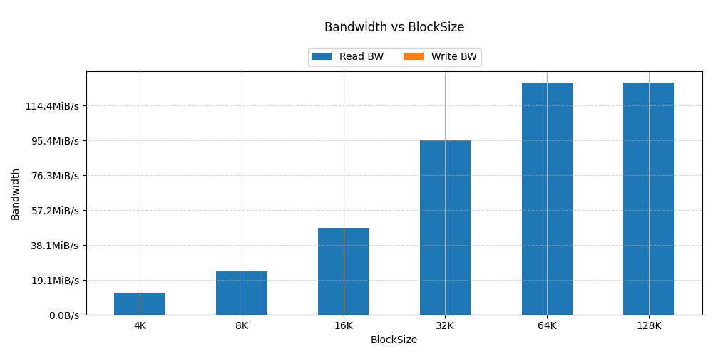 | 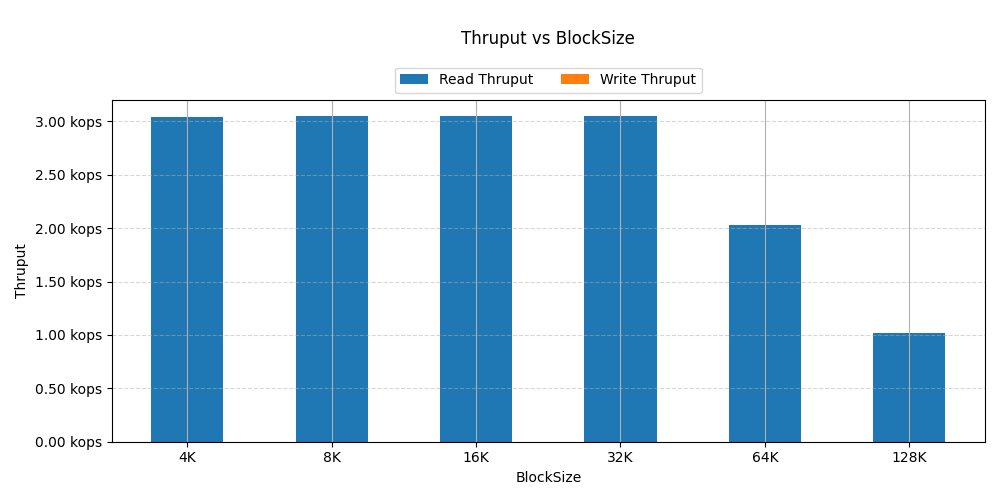 |

| CPU Utilization | Read Latency CDF |
|------------------|-------------------|
| 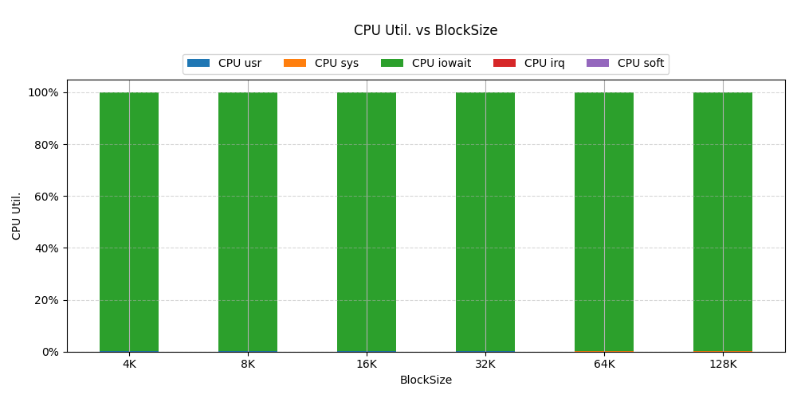 | 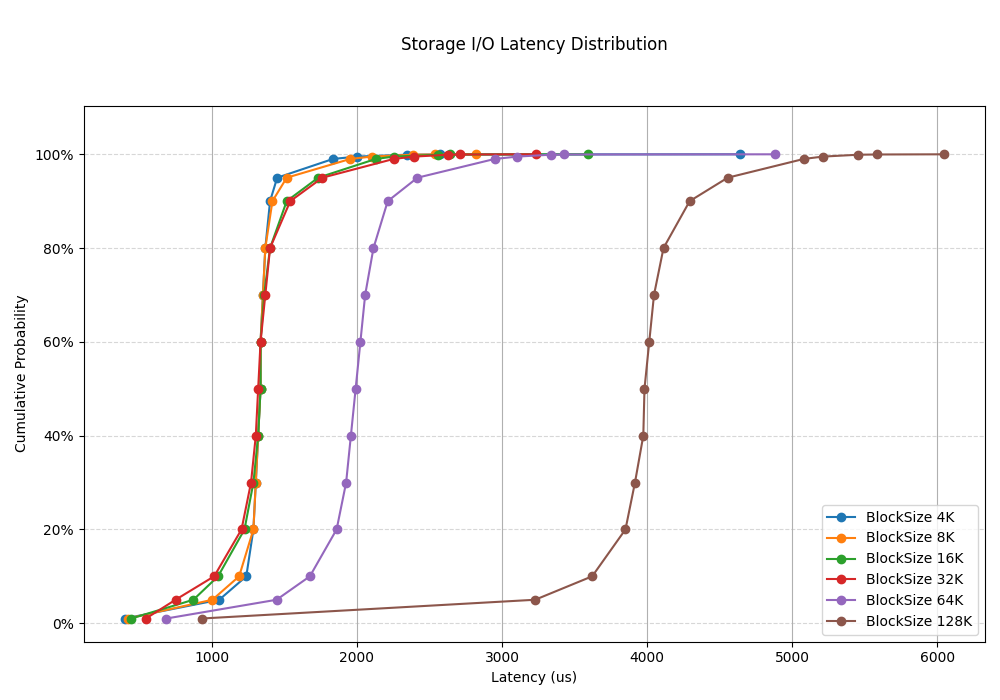 |

### I/O Depth Sweep

This sweep varies the I/O queue depth (the number of outstanding requests) while keeping the request size and process count constant.  
It measures how effectively the device exploits parallelism.

#### Console summary

| IODepth | Read BW (MB/s) | Write BW (MB/s) | Total BW (MB/s) | Read Thruput (kops) | Write Thruput (kops) | Thruput (kops) | Read Lat. (us) | Write Lat. (us) | Lat. (us) | CPU usr (%) | CPU sys (%) | CPU iowait (%) |
|---------|----------------|-----------------|------------------|-----------------------|------------------------|-----------------|-----------------|------------------|-----------|--------------|---------------|----------------|
| 1       | 11.9           | 0.0             | 11.9             | 3.0                   | 0.0                    | 3.0             | 1311.8          | 0.0              | 1311.8    | 0.1          | 0.1           | 99.7           |
| 2       | 11.9           | 0.0             | 11.9             | 3.0                   | 0.0                    | 3.0             | 1311.3          | 0.0              | 1311.3    | 0.1          | 0.1           | 99.7           |
| 4       | 11.9           | 0.0             | 11.9             | 3.0                   | 0.0                    | 3.0             | 1311.3          | 0.0              | 1311.3    | 0.4          | 0.2           | 98.4           |
| 8       | 11.9           | 0.0             | 11.9             | 3.0                   | 0.0                    | 3.0             | 1311.4          | 0.0              | 1311.4    | 0.5          | 0.2           | 98.5           |
| 16      | 11.9           | 0.0             | 11.9             | 3.0                   | 0.0                    | 3.0             | 1311.4          | 0.0              | 1311.4    | 0.1          | 0.1           | 99.8           |
| 32      | 11.9           | 0.0             | 11.9             | 3.0                   | 0.0                    | 3.0             | 1311.3          | 0.0              | 1311.3    | 0.1          | 0.1           | 99.8           |
| 64      | 11.9           | 0.0             | 11.9             | 3.0                   | 0.0                    | 3.0             | 1311.3          | 0.0              | 1311.3    | 0.1          | 0.1           | 99.7           |
| 128     | 11.9           | 0.0             | 11.9             | 3.0                   | 0.0                    | 3.0             | 1311.4          | 0.0              | 1311.4    | 0.7          | 0.2           | 98.7           |

#### Plots for details

| Bandwidth | I/O Rate |
|-----------|----------|
| 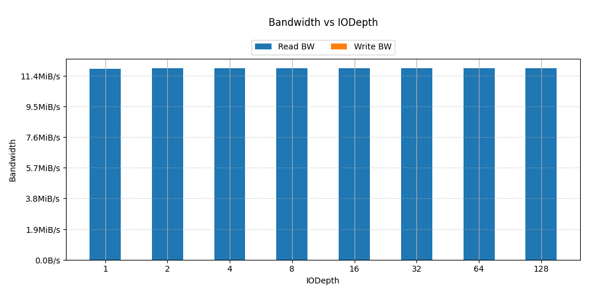 | 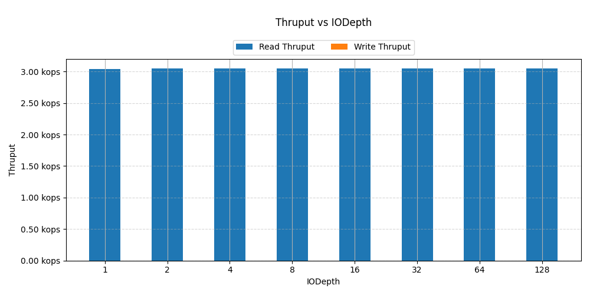 |

| CPU Utilization | Read Latency CDF |
|------------------|-------------------|
| 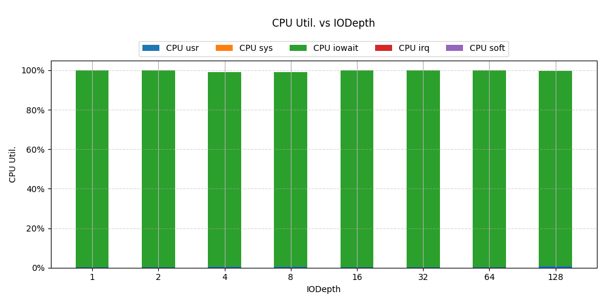 | 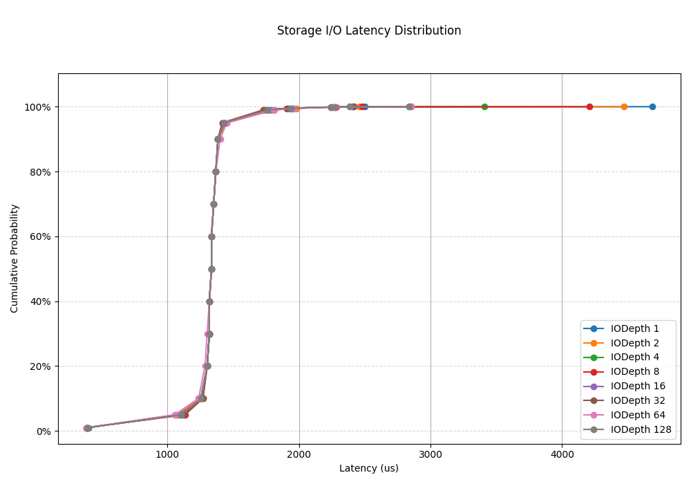 |

### Concurrent Process Count Sweep

This sweep varies the number of concurrent processes issuing I/O.  
It evaluates scaling across CPU cores and submission queues, and highlights the point at which performance no longer improves.

#### Console summary

| ProcessCount | Read BW (MB/s) | Write BW (MB/s) | Total BW (MB/s) | Read Thruput (kops) | Write Thruput (kops) | Thruput (kops) | Read Lat. (us) | Write Lat. (us) | Lat. (us) | CPU usr (%) | CPU sys (%) | CPU iowait (%) |
|--------------|----------------|-----------------|------------------|-----------------------|------------------------|-----------------|-----------------|------------------|-----------|--------------|---------------|----------------|
| 1            | 7.0            | 0.0             | 7.0              | 1.8                   | 0.0                    | 1.8             | 552.7           | 0.0              | 552.7     | 0.1          | 0.1           | 24.9           |
| 2            | 11.9           | 0.0             | 11.9             | 3.0                   | 0.0                    | 3.0             | 655.5           | 0.0              | 655.5     | 0.1          | 0.2           | 49.7           |
| 4            | 11.9           | 0.0             | 11.9             | 3.0                   | 0.0                    | 3.0             | 1311.3          | 0.0              | 1311.3    | 0.1          | 0.2           | 99.7           |
| 8            | 11.9           | 0.0             | 11.9             | 3.0                   | 0.0                    | 3.0             | 2622.3          | 0.0              | 2622.3    | 0.1          | 0.3           | 99.6           |
| 16           | 11.9           | 0.0             | 11.9             | 3.0                   | 0.0                    | 3.0             | 5245.5          | 0.0              | 5245.5    | 0.1          | 0.5           | 99.3           |

#### Plots for details

| Bandwidth | I/O Rate |
|-----------|----------|
| 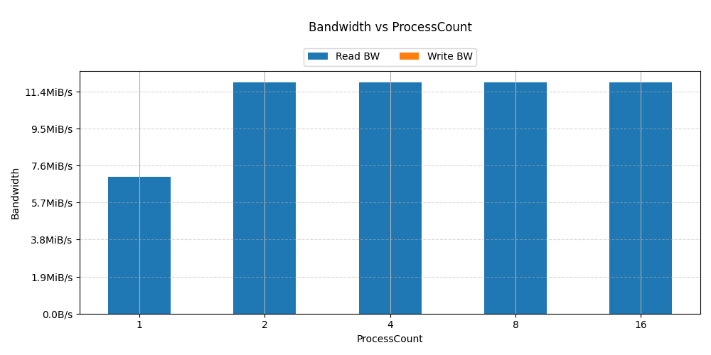 | 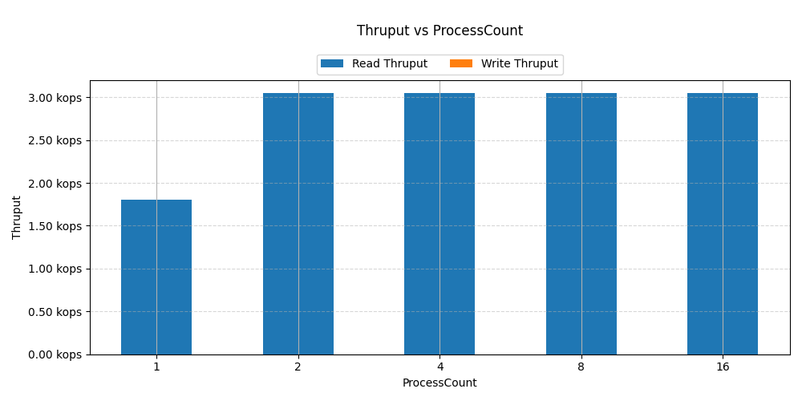 |

| CPU Utilization | Read Latency CDF |
|------------------|-------------------|
| 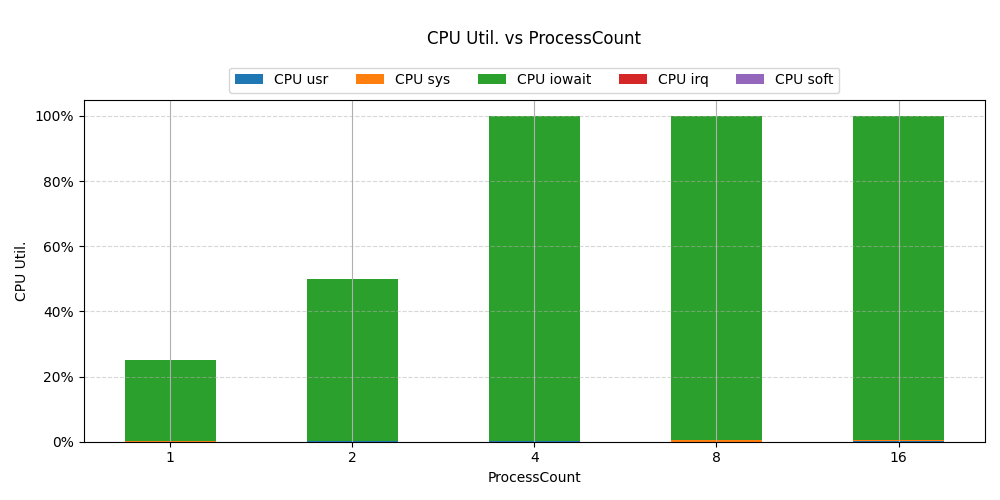 | 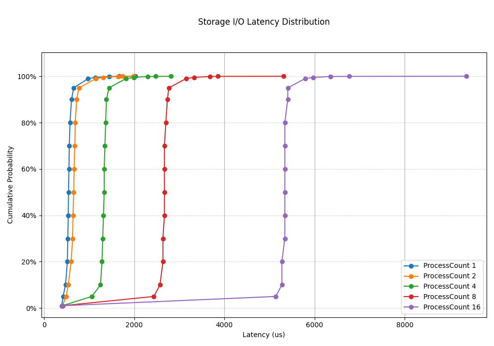 |

### Access Pattern Sweep

This sweep evaluates different workload profiles, including sequential and random access patterns, and the mix of read and write operations.
It highlights the workload sensitivity of the device.

#### Console summary

| AccessPattern | Read BW (MB/s) | Write BW (MB/s) | Total BW (MB/s) | Read Thruput (kops) | Write Thruput (kops) | Thruput (kops) | Read Lat. (us) | Write Lat. (us) | Lat. (us) | CPU usr (%) | CPU sys (%) | CPU iowait (%) |
|---------------|----------------|-----------------|------------------|-----------------------|------------------------|-----------------|-----------------|------------------|-----------|--------------|---------------|----------------|
| read          | 11.9           | 0.0             | 11.9             | 3.0                   | 0.0                    | 3.0             | 1311.8          | 0.0              | 1311.8    | 0.1          | 0.1           | 99.8           |
| write         | 0.0            | 11.9            | 11.9             | 0.0                   | 3.0                    | 3.0             | 0.0             | 1311.4           | 1311.4    | 0.0          | 0.4           | 99.4           |
| randread      | 11.9           | 0.0             | 11.9             | 3.0                   | 0.0                    | 3.0             | 1311.3          | 0.0              | 1311.3    | 0.1          | 0.2           | 99.7           |
| randwrite     | 0.0            | 11.9            | 11.9             | 0.0                   | 3.0                    | 3.0             | 0.0             | 1311.3           | 1311.3    | 0.0          | 0.4           | 99.6           |
| rw            | 8.3            | 3.6             | 11.9             | 2.1                   | 0.9                    | 3.0             | 1235.1          | 1488.3           | 1311.4    | 0.1          | 0.3           | 99.7           |
| randrw        | 8.3            | 3.6             | 11.9             | 2.1                   | 0.9                    | 3.0             | 1237.9          | 1481.8           | 1311.4    | 0.1          | 0.3           | 99.4           |

#### Plots for details

| Bandwidth | I/O Rate | CPU Utilization |
|-----------|----------|------------------|
| 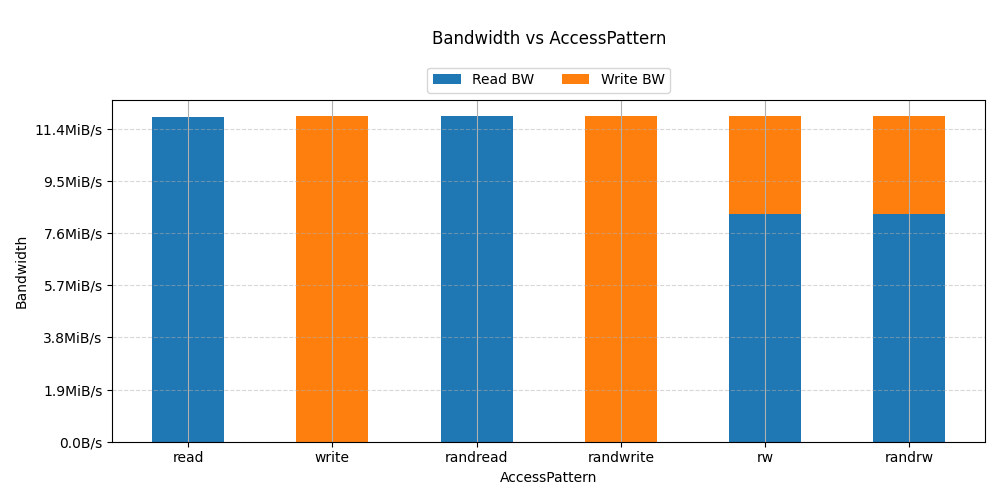 | 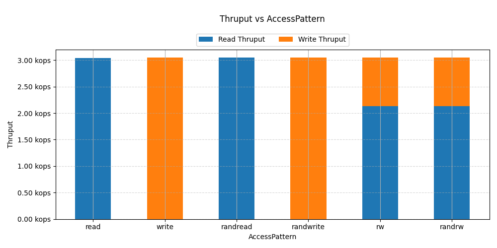 | 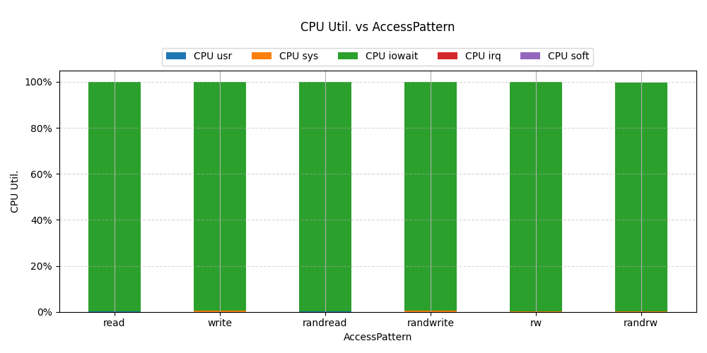 |

| Read Latency CDF | Write Latency CDF |
|------------------|-------------------|
| 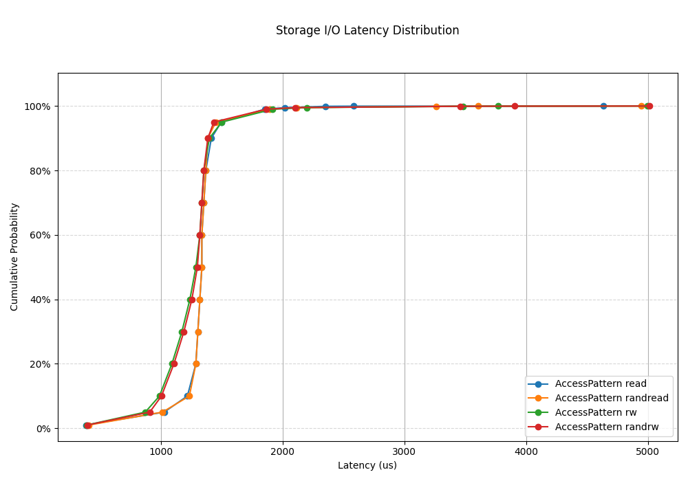 | 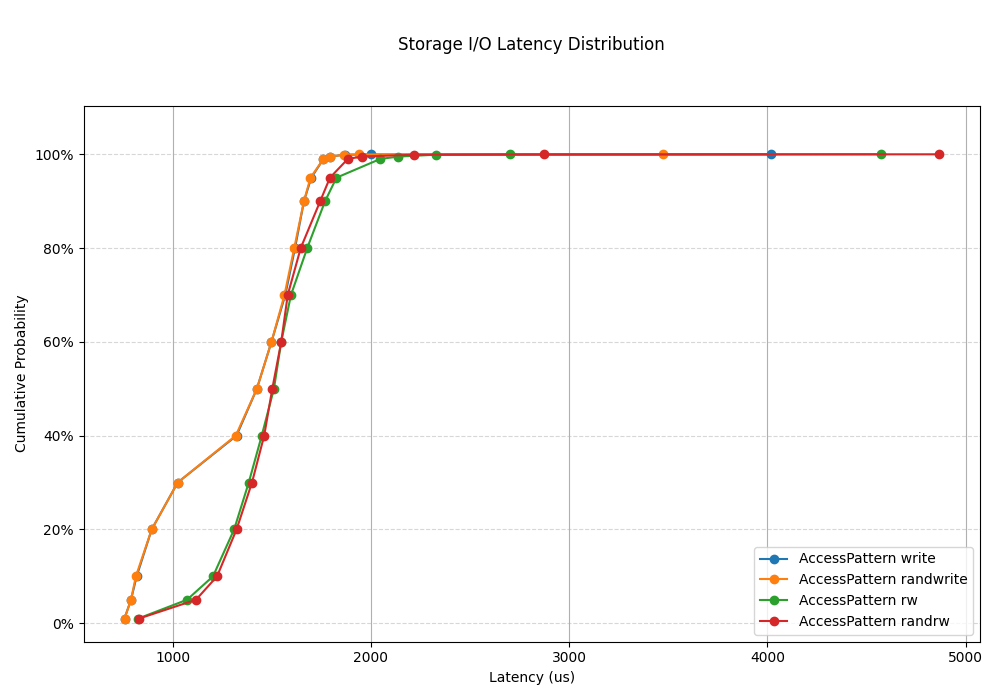 |

## Additional notes

- Run with elevated privileges if direct I/O or device binding requires it.
- Ensure that results directories are on a stable path. ASCT saves data files under the run-specific `data.*` directory.
