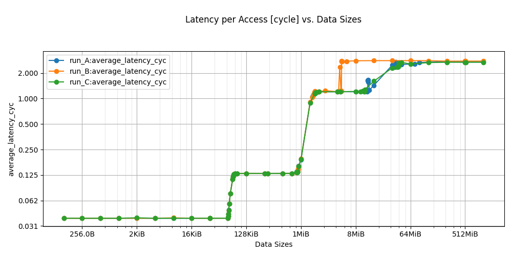
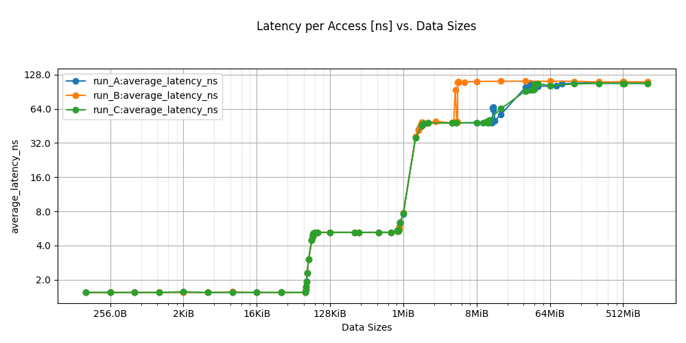
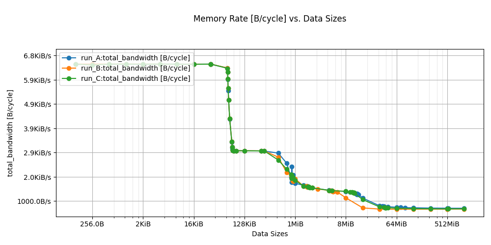
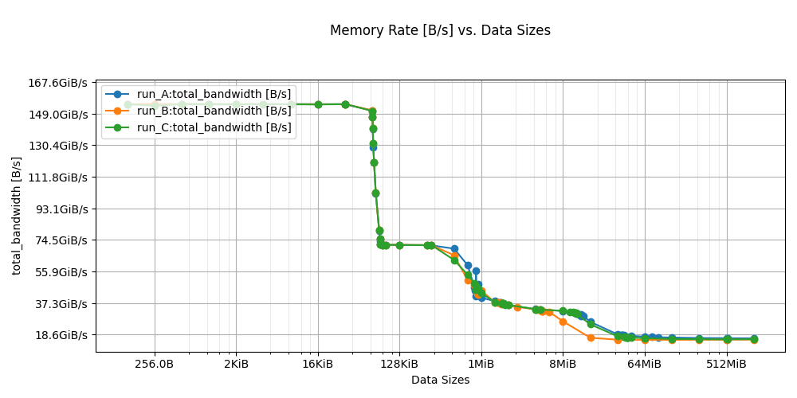
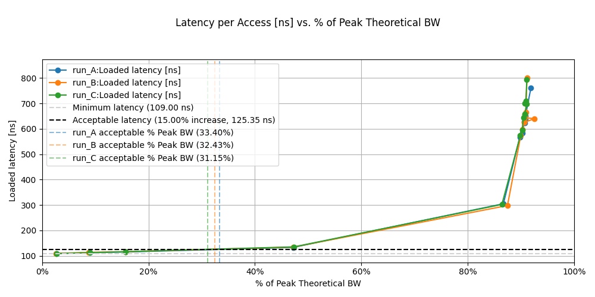

<!--
SPDX-FileCopyrightText: Copyright 2026 Arm Limited and/or its affiliates <open-source-office@arm.com>

SPDX-License-Identifier: Apache-2.0
-->

# Compare run results

Use `asct diff` to compare results from previous ASCT runs. Each ASCT run produces an output directory that contains benchmark results and system information.

You can use `asct diff` to carry out the following tasks:

- Compare results before and after system changes. Examples include kernel updates, firmware updates, tuning changes, or configuration changes to the Basic Input/Output System (BIOS) or Unified Extensible Firmware Interface (UEFI).
- Compare 2 different systems that use the same benchmark set

## What `asct diff` compares

Each ASCT run output directory contains a structured summary of the following information:

- Benchmark measurements
- System configuration information
- Metadata

When you run `asct diff`, ASCT performs the following tasks:

- Loads results from each run directory
- Groups fields by benchmark or measurement name
- Produces a table in standard output or machine-readable CSV or JSON format

### How `asct diff` shows values

For benchmark measurements, ASCT prints the percentage difference between the baseline and each comparison run.

For system configuration reports such as `system-info`, `cmn`, and `metadata`, ASCT prints raw values instead of percentage differences.

If a field is missing in one run, ASCT displays `<missing>`. It reports the change as `added` or `removed`.

<!--For memory benchmark comparisons, use consistent unit settings across runs. For details on setting `cycle_base`, see [Keep units consistent across runs](#keep-units-consistent-across-runs).-->

## Run `asct diff`

Use the `asct diff` command to compare one or more run directories.

### Compare runs

`asct diff` supports comparing any number of runs. ASCT always uses one run as the baseline and compares every other run against it.

To compare 2 runs, use:

```bash
# ASCT uses the first run directory as the baseline
asct diff runA runB
```

To compare 3 runs against the first run as the baseline, use:

```bash
# Compare 3 runs against the first run as the baseline
asct diff runA runB runC
```

To compare many runs against the first run as the baseline, use:

```bash
# Compare any number of runs against the first run as the baseline
asct diff runA runB ... run_n
```

### Specify a baseline

To specify a baseline explicitly, use `--baseline`:

```bash
# Use runB as the baseline and compare runA against it
asct diff runA --baseline runB

# Use runA as the baseline and compare runB and runC against it
asct diff runB runC --baseline runA
```

## Use `asct diff` options

The `asct diff` command supports the common ASCT output and logging options:

- `--format` with values `stdout`, `csv`, or `json`
- `--output-dir`, `--force`
- `--log-level`, `--log-file`, `--quiet`

In addition, `asct diff` supports the following options:

- `--baseline`, `-b BASELINE_DIR`
  - Specify the baseline run directory.
  - When you set this option, you can compare 1 or more run directories against the baseline. You do not need to pass 2 run directories to establish a baseline.

- `--benchmarks`, `-k BENCH [BENCH ...]`
  - Limit the comparison to selected benchmarks or reports.
  - Prefix a benchmark with `^` to exclude it from the comparison.

  Examples:

  ```bash
  # Compare only these reports
  asct diff runA runB --benchmarks system-info peak-bandwidth

  # Compare everything except system-info
  asct diff runA runB --benchmarks ^system-info
  ```

- `--sort-by`, `-s RUN_DIR`
  - Sort the main delta table by a specific comparison column.
  - `RUN_DIR` must match one of the run directory arguments. It must not be the baseline.

  Example:

  ```bash
  asct diff runA runB runC --sort-by runC
  ```

<!--### Keep units consistent across runs

For memory benchmark comparisons, ensure all runs use the same `cycle_base` setting. Use either `cycle_base=true` or `cycle_base=false` for all runs that you compare.

To specify this setting each time you use the `asct run` command, use `--update-config` with the benchmark name as a prefix.

The following example runs selected benchmarks and sets `cycle_base` to `true` for each selected benchmark:

```bash
# Generate each run with the same cycle_base settings
asct run latency-sweep bandwidth-sweep loaded-latency --output-dir <run-dir> \
  --update-config latency-sweep.cycle_base=true \
  --update-config bandwidth-sweep.cycle_base=true \
  --update-config loaded-latency.cycle_base=true

# For example, run the command with runA and runB as output directories, then compare
asct diff runA runB
```

**Note**: `c2c-latency` does not currently support `cycle_base`. Set `cycle_base` only for benchmarks that support this option.

This consistency is required for latency and bandwidth comparisons and generated diff graphs in `asct diff` output.-->

## View `asct diff` output

Use `--output-dir` to specify an output directory.

When you use `--format=csv`, ASCT writes `diff.csv` to the output directory.

When you use `--format=json`, ASCT writes `diff.json` to the output directory.

In addition to tabular output, `asct diff` can generate comparison plots for supported benchmark types. ASCT writes these plot files to the `diff` output directory with the other generated artifacts.

To ensure that comparisons appear more consistently in `asct diff` results, `loaded-latency` and `c2c-latency` provide structured diff fields. Structured diff fields represent differences between runs as explicit data fields, for example baseline, new value, and percentage change. This approach enables filtering, sorting, and automated analysis.

### Diff graphs

`asct diff` can generate PNG graphs in the `diff` output directory.

When the run dataset contains multiple units for the same measurement type, `asct diff` generates one PNG chart per unit instead of a single combined chart.

The following images show example graphs that compare 3 ASCT runs:











## Example output

The following example shows abbreviated standard output from `asct diff`:

```text
Summary
========================================
Stat                  | Value             
========================================
Baseline              | runA           
Total # of Benchmarks | 9                 
========================================

Benchmarks with Most Differences
========================================
Benchmark            | Differences       
========================================            
system-info          | 3                              
peak-bandwidth       | 2                                
metadata             | 2                 
========================================

Differences In System-Info
============================================================================================================================
field                                                   | runA                 | runB                 | runC             
============================================================================================================================
system-info.data.kern_cfg.build_dir                     | /lib/modules/6.14.0- | /lib/modules/6.11.0- | /lib/modules/6.2.0- 
                                                        | 28-generic/build     | rc1-atp+/build       | 36-generic/build    
----------------------------------------------------------------------------------------------------------------------------
system-info.data.kern_cfg.cfg_file                      | /boot/config-6.14.0- | /boot/config-6.11.0- | /boot/config-6.2.0- 
                                                        | 28-generic           | rc1-atp+             | 36-generic          
----------------------------------------------------------------------------------------------------------------------------
system-info.data.kern_cfg.distro                        | Ubuntu 24.04.3 LTS   | Ubuntu 22.04.5 LTS   | Ubuntu 22.04.3 LTS  
----------------------------------------------------------------------------------------------------------------------------

Measurement Delta Percentage Between runA And Comparison Runs
============================================================================================================================
field                                                   | runA                 | runB                 | runC             
============================================================================================================================
peak-bandwidth.data.All Reads.Peak BW [GB/s]            | 186.31               | 155.73%              | 11.86%              
----------------------------------------------------------------------------------------------------------------------------
peak-bandwidth.data.All Reads.% of Peak Theoretical     | 90.97                | -2.57%               | -10.5%              
----------------------------------------------------------------------------------------------------------------------------
peak-bandwidth.data.3:1 Reads-Writes.Peak BW [GB/s]     | 161.98               | 158.14%              | 20.11%              
----------------------------------------------------------------------------------------------------------------------------

Differences In Metadata
============================================================================================================================
field                                                   | runA                 | runB                 | runC             
============================================================================================================================
metadata.version                                        | 0.3.0.               | 0.3.2                | 0.3.1         
----------------------------------------------------------------------------------------------------------------------------

```

This output shows the following information:

- The selected baseline
- The number of benchmarks compared
- The benchmarks with the most differences
- Configuration differences across runs
- Percentage differences for benchmark measurements