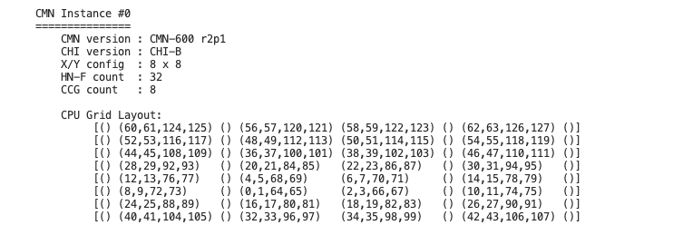
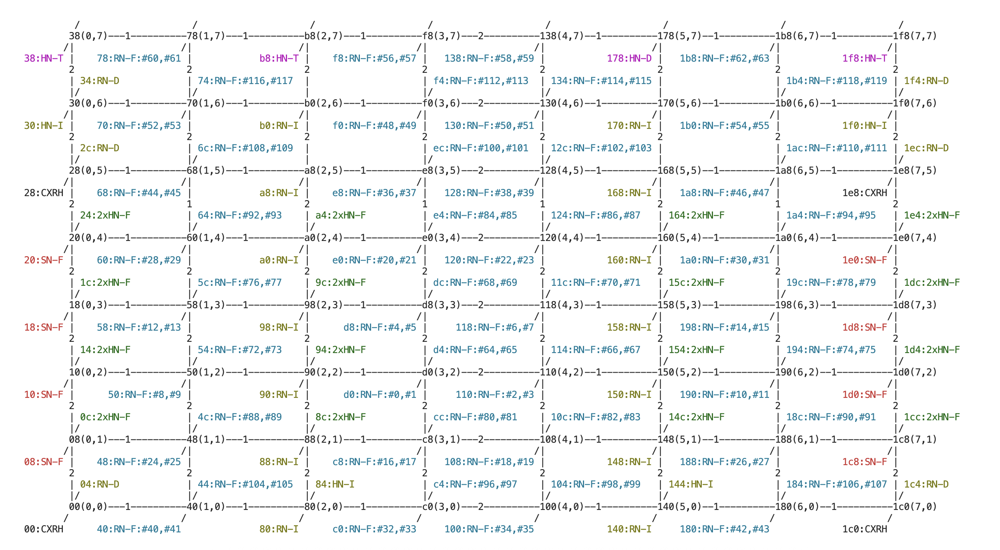
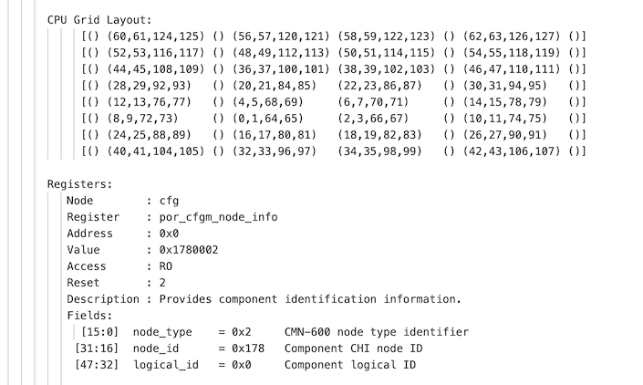

<!--
SPDX-FileCopyrightText: Copyright 2026 Arm Limited and/or its affiliates <open-source-office@arm.com>

SPDX-License-Identifier: Apache-2.0
-->

# System report

This section describes the system reporting commands in ASCT. Use these commands to view hardware, software, and platform configuration details.

ASCT collects system information each time you run `asct run`. Arm Coherent Mesh Network (CMN) reporting is available as a separate command.

Use these commands:

- `asct report system-info`: View hardware and operating system information
- `asct report cmn`: View CMN topology and configuration when present
- `asct report network-info`: View network interfaces, addresses, and namespace information

## View system information

Use the `asct report system-info` command to generate a report that summarizes the hardware and software configuration of the system.

The report captures CPU, memory, interconnect, operating system, and related platform characteristics. Use this information to understand the benchmark environment and interpret performance results.

### What `asct report system-info` collects

The `asct report system-info` report provides a structured snapshot of your system. It includes the following information:

- CPU architecture, core count, and CPU model
- Cache hierarchy and cache line size
- NUMA topology
- Interconnect identification
- Memory capacity and theoretical peak bandwidth
- Memory module details, including manufacturer and part number when available through DMI
- Operating system and kernel details
- Performance tooling and kernel feature checks
- Vulnerability status from kernel reporting

### Run `asct report system-info`

Run this command:

```bash
sudo asct report system-info
```

If you run the command without `sudo`, ASCT collects only a limited set of information. ASCT cannot access Desktop Management Interface (DMI) platform and memory details without elevated privileges.

### Use `asct report system-info` options

`asct report system-info` supports the common ASCT output and logging options.

Example:

```bash
sudo asct report system-info --format=json --output-dir data --force --log-level=error --log-file data/asct.log --quiet
```

### View `asct report system-info` output

ASCT supports these output formats:

- `--format=stdout` (default): Prints the report to the terminal
- `--format=csv`: Writes a key-value CSV to the output directory
- `--format=json`: Writes a combined JSON file to the output directory

ASCT writes these files to the output directory:

- `system-info.csv`
- `report.json`

### Example output

Example output for `asct report system-info`:

```text

SYSTEM-INFO ------------------------------------------------------------

System feature report:
  Collected:           2025-07-17 08:16:18.729527
  ASCT version:        0.4.2
  Running as root:     True

System hardware:
  Architecture:        ARMv8.2
  CPUs:                128
  Interconnect:        CMN-600 x 1

...

```

## View CMN information

Use the `asct report cmn` command to inspect the CMN topology and configuration on supported systems.

The command shows CPU-to-crosspoint mapping. It can also provide topology or register-level detail. Use this information to analyze interconnect layout and potential performance impact.

### What `asct report cmn` collects

Use `asct report cmn` to collect information about the CMN interconnect when it is present on your system.
`asct report cmn` requires root access to gather CMN information.

Depending on the options that you select, the output includes:

- A high-level topology summary
- An ASCII topology diagram
- A register dump view

### Run `asct report cmn`

Before you run `asct report cmn` for the first time, run:

```bash
asct report cmn --detect
```

The `--detect` option performs CMN discovery and CPU mapping. This step can take several minutes.

Then run:

```bash
asct report cmn
```

### Use `asct report cmn` options

Use these optional flags:

- `--update-config cmn.diagram=true`: Prints an ASCII topology diagram
- `--verbose`: Prints additional detail, including registers
- `--detect`: Performs CMN discovery and CPU mapping before reporting

Examples:

```bash
asct report cmn --update-config cmn.diagram=true
asct report cmn --verbose
asct report cmn --detect --verbose
```

### View `asct report cmn` output

ASCT supports these output formats:

- `--format=stdout` (default): Prints the CMN summary or diagram to the terminal
- `--format=csv`: Writes CMN information as a CSV file to the output directory
- `--format=json`: Writes CMN information to the combined JSON report

ASCT writes these files to the output directory:

- `cmn.csv`
- `report.json`

### Example output

The examples in this section are truncated to improve readability.

#### Default output

In the CPU grid layout, each parenthesized group lists the Linux logical CPU IDs that map to a CMN crosspoint (XP) at that grid position. An empty `()` indicates that no CPUs map to that XP.



#### Output with `--update-config cmn.diagram=true`



#### Output with --verbose



## View network information

Use the `asct report network-info` command to inspect network interfaces and address configuration.

The command shows local host addresses and per-interface network details. It can also provide network namespace detail when available. Use this information to analyze connectivity context and namespace layout.

### What `asct report network-info` collects

Use `asct report network-info` to report networking configuration. It includes the following information:

- Local IPv4 and IPv6 addresses
- Host aliases and hostnames (when available)
- Interface details such as MAC address, link state, MTU, and device type
- Per-interface IPv4 and IPv6 addresses
- Network namespace details and per-namespace interfaces (best effort)

### Run `asct report network-info`

Run this command:

```bash
asct report network-info
```

You can run this command without `sudo`. Some namespace details can be unavailable without elevated privileges.

### View `asct report network-info` output

ASCT supports these output formats:

- `--format=stdout` (default): Prints the report to the terminal
- `--format=csv`: Writes a key-value CSV to the output directory
- `--format=json`: Writes a combined JSON file to the output directory

ASCT writes these files to the output directory:

- `network-info.csv`
- `report.json`

### Example output

Example output for `asct report network-info`:

```text
  Local IPv4:         10.248.2.155, 127.0.0.1, 172.17.0.1
  Local IPv6:         ::1
                      fe80::14e8:48ff:fe5f:7c43
                      fe80::27:9cff:fe62:5605
                      fe80::cc07:6aff:fe0d:215a
                      fe80::d064:9fff:fe0b:7dbf
  Aliases:            localhost
  Interfaces:
    lo: type=Loopback mac=00:00:00:00:00:00 loc=virtual port=0
      Status: state=UNKNOWN, admin=up, carrier=up, mtu=65536
      IPv4: 127.0.0.1
      IPv6: ::1 (loopback)
    enP11p4s0: type=Ethernet mac=02:27:9c:62:56:05 loc=PCI 000b:04:00.0 port=0
      Status: state=UP, admin=up, carrier=up, mtu=9001
      IPv4: 10.248.2.155
      IPv6: fe80::27:9cff:fe62:5605 (link-local, on-link only)
...

```
